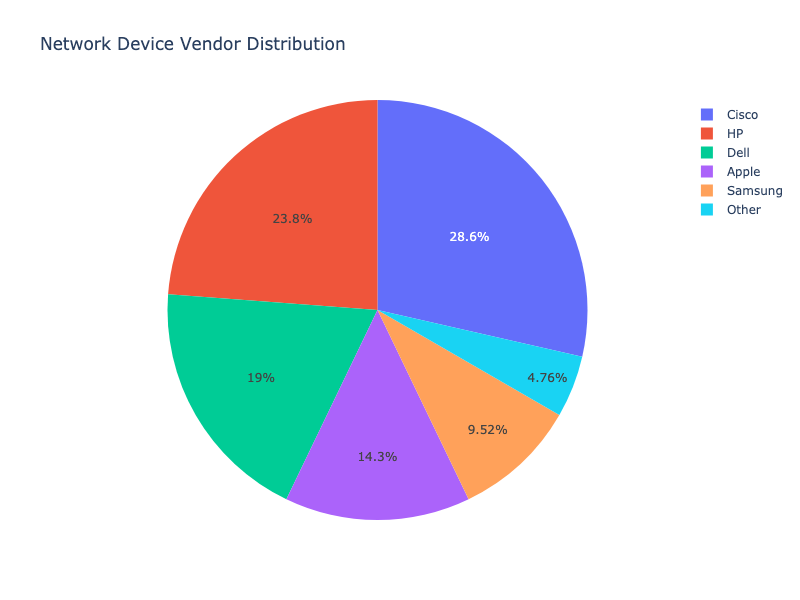
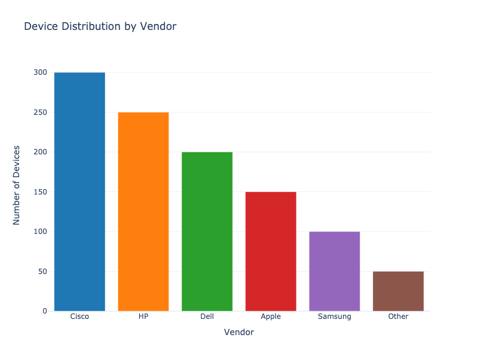
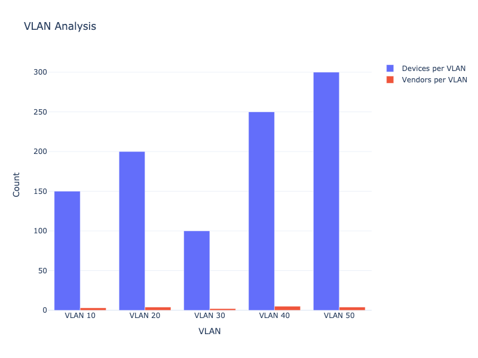

# NetVendor

## Introduction
*What vendors are lurking on your network? This software figures this out!*

NetVendor is a Python tool designed specifically for network administrators and cybersecurity professionals to analyze and visualize the vendor distribution of all devices on their network. It processes MAC address tables and IP ARP data from Cisco, HP/Aruba, and other network routers and switches to provide detailed insights into your network's composition.


*NetVendor provides comprehensive network device analysis and visualization*

## Quick Navigation
- 🚀 [Getting Started](#getting-started) - This app processes MAC address tables and IP ARP data from Cisco, HP/Aruba, and other network devices to provide detailed insights into your network's compoistion and setup
- 📋 [Features](#features) - What NetVendor can do
- 📖 [Usage Guide](#usage) - How to use the tool
- 📥 [Input/Output](#input) - File formats and results
- 📈 [Project Status](#project-status) - Updates and future plans

## Features
- Parse MAC address tables from network devices (routers and switches)
- Identify device vendors using IEEE OUI database
- Fast local lookups using pre-seeded cache (53,000+ entries)
- Secure operation with minimal external API calls
- Generate comprehensive reports and visualizations
- Support for multiple network device output formats
- Real-time progress tracking
- Interactive HTML dashboard
- Detailed port analysis for network troubleshooting
- VLAN distribution analysis
- Vendor-specific network insights
- Network security assessment capabilities
- Asset inventory management
- Network topology mapping
- Historical data tracking
- Integration with network management systems

### Why Use NetVendor?
- **Network Security**: Network administrators can quickly identify unauthorized or unexpected devices on their network
- **Asset Management**: Track and manage network infrastructure by vendor
- **Network Visibility**: Clear visualization of device distribution across VLANs and ports
- **Port Analysis**: Detailed insights into port utilization and device connections on switches
- **Change Tracking**: Monitor network infrastructure changes over time
- **Efficiency**: Fast processing with progress tracking for large network datasets
- **Organization**: All output files are neatly organized for easy reference
- **Speed & Security**: Most vendor lookups are performed locally using a pre-seeded cache, minimizing external API calls and ensuring fast, secure operation


*Interactive security dashboard showing device distribution and potential security concerns*

### How It Works
1. **Device Discovery**
   - Processes MAC addresses from network devices
   - Identifies vendors using IEEE OUI database
   - Maps devices to network segments

2. **Data Organization**
   - Groups devices by vendor
   - Tracks VLAN assignments
   - Maps port connections
   - Analyzes network topology

3. **Visualization**
   - Creates interactive vendor distribution charts
   - Generates VLAN analysis graphs
   - Shows device distribution patterns
   - Provides network security insights

4. **Analysis**
   - Identifies vendor patterns
   - Highlights network security concerns
   - Tracks device distribution
   - Monitors network changes

## Target Audience
NetVendor is designed for:
- Network administrators managing enterprise networks
- Network engineers responsible for infrastructure
- Network architects planning network changes
- Network security teams monitoring device access
- Cybersecurity professionals assessing network security
- IT managers overseeing network infrastructure
- Network operations teams maintaining network health
- Network consultants providing network analysis
- Network auditors performing compliance checks

## Getting Started

### Prerequisites
- Working internet connection (for IEEE OUI database updates)
- Input file containing MAC addresses from network devices (routers and switches)
- Python 3.6 or higher
- Required Python packages:
  - requests
  - plotly
  - rich
  - tqdm

### Installation
1. Clone the repository:
```bash
git clone https://github.com/StewAlexander-com/NetVendor.git
cd NetVendor
```

2. Install the package:
```bash
pip install -e .
```

## Usage

### Basic Usage
Run the script with your network device output file:
```bash
netvendor input_file.txt
```

The tool will:
1. Process the MAC addresses or ARP data from your network devices
2. Identify vendors using the IEEE OUI database
3. Generate comprehensive reports and visualizations
4. Create an interactive dashboard showing vendor distribution
5. Provide detailed port analysis and VLAN insights
6. Output all results to the `output` directory

### Windows Runtime Commands
If you are on Windows please run this script from PowerShell using these commands:
```powershell
$env:PYTHONIOENCODING = "utf-8"
$env:PYTHONUTF8 = "1"
python3 -m netvendor MAC-Table.txt
```

### Input File Format
The tool accepts output from common network device commands:

1. **Cisco IOS/IOS-XE MAC Address Table**
```
Vlan    Mac Address       Type        Ports
----    -----------      --------    -----
 10     0011.2233.4455   DYNAMIC     Gi1/0/1
```

2. **Cisco NX-OS MAC Address Table**
```
VLAN     MAC Address     Type        Port
----     -----------     --------    -----
 10      0011.2233.4455  dynamic     Eth1/1
```

3. **Cisco IOS/IOS-XE ARP Table**
```
Protocol  Address          Age (min)  Hardware Addr   Type   Interface
Internet  192.168.1.1            -   0011.2233.4455  ARPA   GigabitEthernet1/0/1
```

4. **HP/Aruba MAC Address Table**
```
MAC Address       Port    Type    VLAN
0011.2233.4455    1       dynamic 10
```

### Output Files
The tool generates several output files in the `output` directory:

1. **Device Information CSV**
   - Lists all discovered network devices
   - Includes MAC address, vendor, VLAN, and port information
   - Useful for inventory management and network documentation

2. **Port Report CSV** (for MAC address tables)
   - Shows port utilization on switches
   - Lists devices connected to each port
   - Includes VLAN and vendor information per port
   - Helps with network troubleshooting and capacity planning

3. **Vendor Distribution HTML**
   - Interactive dashboard with multiple visualizations
   - Vendor distribution pie chart
   - VLAN analysis charts
   - Device distribution across network segments
   - Helps network administrators understand their network composition


*Interactive vendor distribution dashboard showing device types and network segments*

4. **Vendor Summary Text**
   - Plain text summary of vendor distribution
   - Quick reference for network documentation
   - Easy to share with team members

## Project Status
NetVendor is actively maintained and regularly updated with new features and improvements. Future plans include:
- Support for additional network device output formats
- Enhanced visualization options
- Network topology mapping
- Historical data tracking
- Integration with network management systems

## Contributing
Contributions are welcome! Please feel free to submit a Pull Request.

## License
This project is licensed under the MIT License - see the LICENSE file for details.
